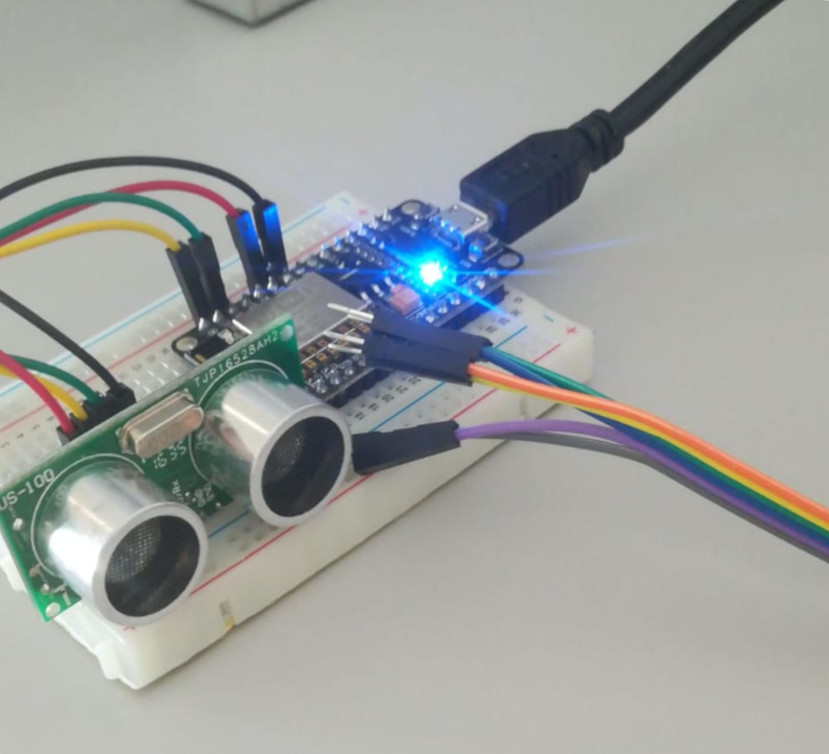

# Domótica

## Prácticas

### ETS5

1. [Atenuador de luces](Prácticas/ETS5/Atenuador_de_luces.knxproj)
2. [Detector de presencia](Prácticas/ETS5/Detector_de_presencia.knxproj)
3. [Detector de temperatura](Prácticas/ETS5/Detector_de_temperatura.knxproj)

* [Memoria de prácticas](Prácticas/Memoria_practicas.pdf)

### Telémetro con Arduino

1. [Leer los datos del telémetro](Prácticas/Telémetro/telemetro_v1.ino)
2. [Mandar los datos a un canal de ThingSpeak](Prácticas/Telémetro/telemetro_v2.ino)
    * https://thingspeak.com/channels/750774/
3. [Mandar los datos al servidor MQTT de ThingSpeak](Prácticas/Telémetro/telemetro_v3.ino)
4. [Mandar los datos al servidor MQTT de la escuela](Prácticas/Telémetro/telemetro_v4.ino)

## Teoría

### Examen final

* [Preguntas con respuesta](Teoría/Examen/README.md)

### Ensayo

* [Chromecast. Funcionamiento y protocolos](DOM/Teoría/Ensayo/Ensayo_Chromecast.pdf)
* [Presentación](DOM/Teoría/Ensayo/Presentacion.pdf)

### Certificados

* [Certificado KNX](Teoría/certificados/KNX.pdf)
