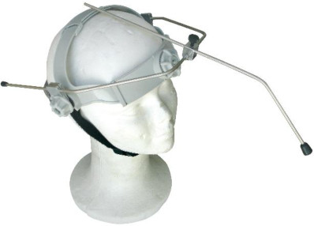

# Respuestas al examen final de Domótica

**Para poner en marcha la calefacción de un sistema de circuito cerrado de agua hay que conmutar con un contactor el quemador de la caldera**

- [x] Falso

**En un segmento Lonworks se pueden conectar hasta**
- [x] 64 nodos

**La convección es el proceso de transporte  de calor por las corrientes de fluidos**
- [x] Verdadero

**Un incremento de 1 grado centígrado en la temperatura de consigna de un sistema de calefacción supone un incremento del 7% en el gasto energético de dicho sistema**
- [x] Verdadero

**¿A qué frecuencia funciona KNX-RF?**
- [x] 868.3 MHz

**La distribución bitubo para un sistema de calefacción con radiadores de agua, requiere el uso de válvulas de 4 vías**
- [x] Falso

**¿Cómo se llama el servidor en una comunicación MQTT?**
> Broker

**Las calderas que usan biomasa como combustible, tienen un balance nulo de aporte de CO2 a la atmósfera**
- [x] - [x] Verdadero

**¿A qué frecuencia funciona EnOcean?**
- [x] 868.3 MHz

**¿A qué frecuencia funciona Z-Wave?**
- [x] 868.4 MHz

**Para averiguar si un filtro de una instalación de ventilación está sucio, se usa un sensor de presión diferencial**
- [x] Verdadero

**DALI permite regulación…**
- [x] Logarítmica de la iluminación con 256 niveles de regulación

**Para ajustar la potencia calorífica de la calefacción de un edificio globalmente se regula la temperatura del agua caliente del circuito cerrado, en función de la temperatura exterior**
- [x] Verdadero

**En una red ZigBee**
- [x] Los enrutadores y el coordinador son FFD

**La racionalización de cargas eléctricas tiene como objetivo aumentar la potencia eléctrica contratada**
- [x] Falso

**¿Cómo se llama la alianza fundada por Sony en 2003 para certificar dispositivos capaces de compartir contenido multimedia en una HAN?**
> DLNA

**El autoconsumo fotovoltaico es la producción individual de electricidad para el propio consumo, a través de paneles solares fotovoltaicos, y permite además, en España, la venta a las compañías eléctricas de la producción eléctrica sobrante**
- [x] Falso

**X10 fue diseñado en los años**
- [x] Setenta

**¿Cuantos grupos permite el sistema DALI?**
> 16

**En Europa con ZigBee podemos comunicar con**
- [x] 16 canales en 2,4GHz y 1 canal en 868 MHz

**Un edificio inteligente es aquel que tiene automatizadas sus principales funciones Domóticas**
- [x] Falso

**Los captadores solares captan la energía calorífica del sol y la transmiten directamente al agua caliente sanitaria, sin necesidad de utilizar  un intercambiador térmico**
- [x] Falso

**En DMX512 a la salida del último dispositivo de cada "Daisy Chain" se coloca**
- [x] Un terminador de 120 ohmios

**La Domótica tiene como principales objetivos el incremento del confort de los usuarios de las viviendas y la seguridad de bienes y personas**
- [x] Falso

**¿Qué clases de dispositivo establece IEEE802.15.4?**
- [x] FFD y RFD

**¿Cuántas escenas de iluminación permite DALI?**
- [x] 16 escenas

**Z-Wave admite hasta**
- [x] 232 dispositivos/red

**Con DALI, los dispositivos se acceden**
- [x] De las 3 formas siguientes.
- [ ] Solo de forma individual: hasta 64 direcciones individuales
- [ ] Solo por grupos: hasta 16 grupos
- [ ] Solo de forma simultánea: comando de multidifusión (broadcast).

**¿Qué sistema usa mecanismos del tipo *energy harvesting*?**
- [x] EnOcean

**El protocolo IGD (Internet Gateway Device Protocol) permite a UPnP atravesar NAT en las pasarelas que conectan la HAN a internet**
- [x] Verdadero

**6LoWPAN es**
- [x] Un estándar de comunicación para WSN

**¿Cuál de los siguientes consiste en una regulación analógica de la luz?**
- [x] Control de iluminación 0/1-10 V

**En el RFC 3927 se reservan para autoIP las direcciones**
- [x] 169.254/16

**Una bomba de calor transfiere energía térmica desde una fuente fría a otra más caliente**
- [x] Verdadero

**DMX512 es muy usado**
- [x] Para la iluminación y efectos especiales en espectáculos

**¿A qué velocidad funciona KNX-TP1?**
- [x] 9.600bps

**DALI es un estándar de regulación de nivel luminoso**
- [x] Verdadero

**Un sistema de Gestión Técnica de Edificios debe integrar todos los subsistemas domóticos bajo una misma normalización**
- [x] Verdadero

**¿Cuántos nodos se pueden conectar en un segmento Lonworks?**
> 64

**Qué sistemas usan direccionamiento IPv6:**
- [ ] 6LoWPAN y EnOcean
- [ ] ZigBee y Z-Wave
- [ ] Las dos anteriores son ciertas
- [x] Ninguna de las anteriores es cierta

**Los medidores de energía calorífica disponen de dos sensores de temperatura y de un caudalímetro**
- [x] Verdadero

**La especificación NB-IoT se congeló en la versión 13 de la especificación 3GPP (LTE-Advanced Pro), en junio de 2016**
- [x] Verdadero

**El suelo refrigerante se utiliza exclusivamente en zonas cercanas a la costa, donde su rendimiento es óptimo**
- [x] Falso

**Para aumentar la potencia de calefacción de un sistema de calefacción de suelo radiante se utiliza una válvula de 3 vías y una bomba, para regular la temperatura del agua caliente que se transmite a los radiadores**
- [x] Verdadero

**En DMX512 a la salida del último dispositivo de cada "Daisy Chain" se coloca**
- [x] Nada

**La especificación NB-IoT se congeló en la versión 11 de la especificación 3GPP (LTE-Advanced Pro), en junio de 2016**
- [x] Falso

**Todos los quemadores que se acoplan a las calderas son de una marcha (de tipo todo-nada)**
- [x] Falso

**¿A qué velocidad funciona KNX-TP0?**
- [x] 4.800bps

**¿A qué velocidad funciona KNX-TP1?**
- [x] 9.600bps

**El bus KNX-TP se alimenta a**
- [x] 29V

**¿Qué frecuencia tienen las ráfagas que se insertan en los cruces por cero en X10?**
- [x] 120KHz

**El significado de las siglas DLNA es**
- [x] Digital Living Network Alliance

**¿Cuál de las siguientes afirmaciones es falsa?**
- [x] ZigBee tiene mayor velocidad de transferencia que BLuetooth

**Se utiliza la regulación y conmutación de luces como sistema de seguridad ante intrusos**
- [x] Verdadero

**¿Con qué siglas se conoce a los discos de almacenamiento que pueden conectarse directamente a la red?**
- [x] NAS

**IEEE 802.15.4**
- [x] Es un estándar de comunicación de la capa física y subcapa MAC

**El estándar europeo KNX surge a partir de**
- [x] EIB, BatiBUS y EHS

**¿Qué norma usa NFC?**
- [x] ISO 14443

**¿Qué longitud tiene una dirección IPv6?**
- [x] 128 bits

**El protocolo DMX512 envía en cada paquete**
- [x] Hasta 513 caracteres, siendo el primero el código de inicio (start code) y el resto valores de los canales (máximo 512)

**Medio de comunicación de DALI**
- [x] Cable de 5 hilos

**¿Qué es el *energy harvesting*?**
- [x] Un proceso de generación de electricidad a partir de energía del entorno

**¿Cómo se llama el dispositivo mostrado en la imagen?**

- [x] Licornio
