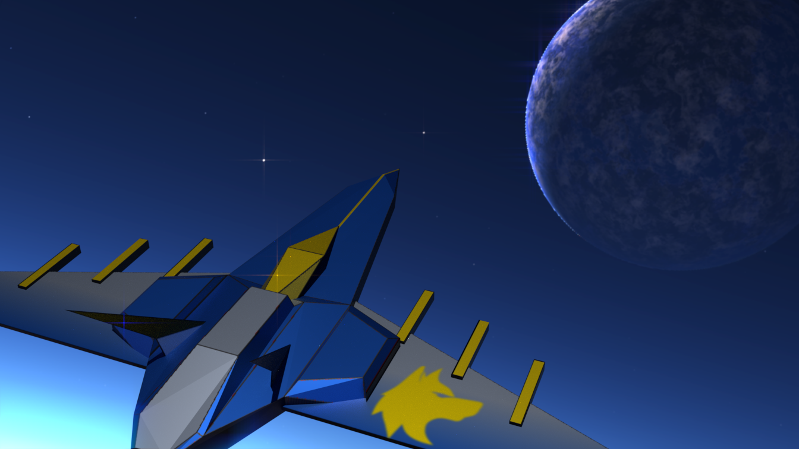
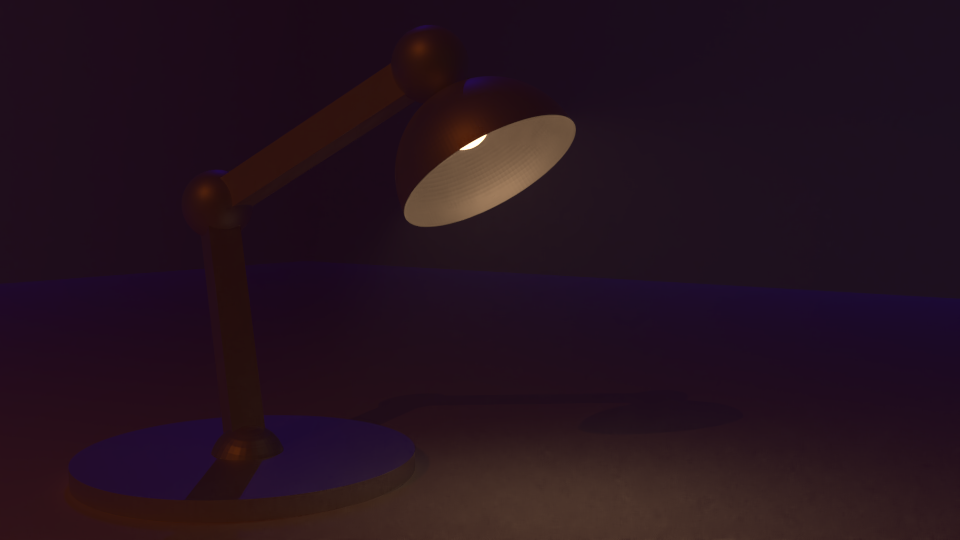
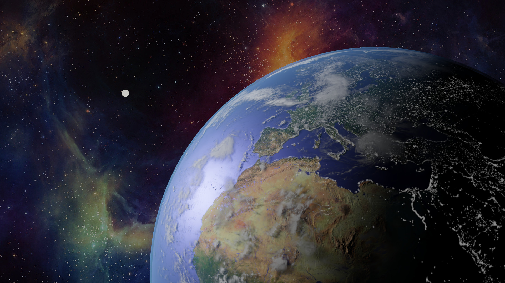

# Entornos Virtuales

## Prácticas

1. [Modelado con Blender](Prácticas/1/documentacion.pdf)
2. [Propuesta de diseño de un sistema inmersivo](Prácticas/2/practica_2.pdf)
3. [Grafos de escena](Prácticas/3/practica_3.pdf)
4. [Texturas](Prácticas/4/practica4.pdf)
5. [Simulación física](Prácticas/5/practica5.pdf)
6. [Interacción y práctica final](https://github.com/gomezportillo/bge_space_invaders)

### Renderizados

#### Práctica 1

#### Práctica 3

#### Práctica 4

## Teoría

* [Tema 2. Mapas de normales](Teoría/Ejercicios/2/tema2.pdf)
